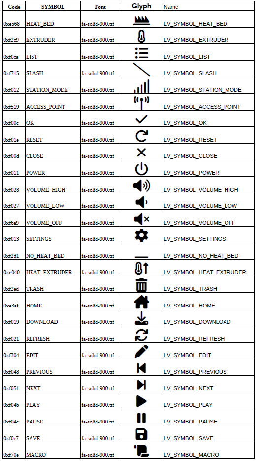
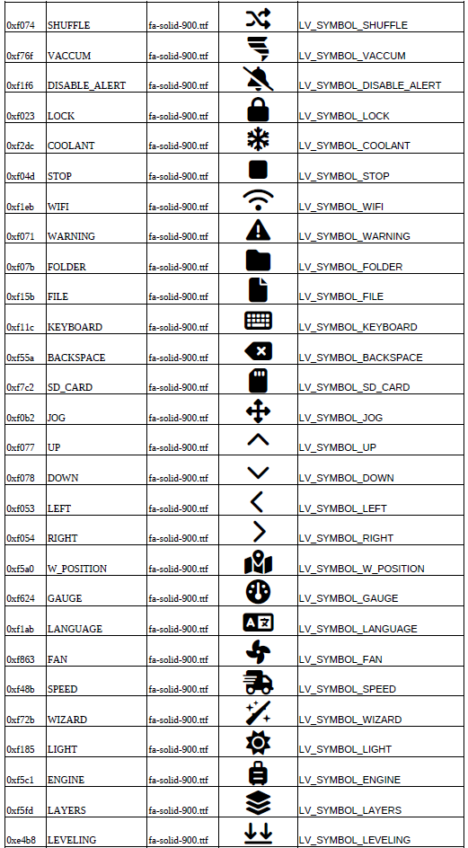

# Project archiecture reference (Work in Progress)

## Introduction

The Goal of this document is to provide a high level overview of the project architecture. This document is a work in progress and will be updated as the project evolves.

## Files and Directories

The project is organized into the following directories:

- `cmake`: Contains the cmake files for the project and for each target
- `components`: Contains the main components of the project
- `customization`: Contains the customization files for the project to avoid to change in sources
- `docs`: Contains project documentation
- `embedded`: Contains the code for embedded maintenance web page of the firmware
- `hardware`: Contains the hardware specific files like drivers, partitions description, specific sdkconfig, hardware configuration files
- `resources`: Contains the graphical resources like logo for bootsplash, icons, etc
- `main`: Contains the main code of the project   
- `scripts`: Contains the scripts used for the project like the fonts builder, the language pack builder, etc
- `tools`: Contains the tools used for the project to test features 
- `translations`: Contains the language files for the firmware
- `CMakelists.txt`: The main CMake file for the project
- `LICENSE`: The license file for the project
- `README.md`: The main readme file for the project
- `.gitignore`: The git ignore file for the project
- `.gitmodules`: The git submodules file for the project
- `.github`: The github actions directory for the project

### cmake directory

The `cmake` directory contains the cmake files for the project and for each target. The cmake files are organized into the following files and subdirectories:
- `dev_tools.cmake`: Contains the cmake file for the development tools (log level, benchmark, log color, etc), this file can be edited but only for debug purpose
- `features.cmake`: Contains the cmake file for the features of the project (wifi, webserver, etc)
- `sanity_check.cmake`: Contains the cmake file for the sanity check of the project
- `targets.cmake`: Complete the cmake file of the project according target board
- `targets` directory : contains the cmake file for each target board, the file is named as the target board name

Each target file contains the following sections:
```
# Ensure the board is enabled in CMakeLists.txt
if(<BOARD_NAME>) #<BOARD_NAME> is enabled or not in CMakeLists.txt
    # Add board name (Mandatory)
    set(TFT_TARGET "<BOARD_NAME>")
    # Add the sdkconfig file path (Mandatory), it can be specific or based on one of the common sdkconfig   
    set(SDKCONFIG  ${CMAKE_SOURCE_DIR}/hardware/<BOARD_NAME>/sdkconfig)
    # Add Specific Components if any for the board (Mandatory)
    list(APPEND EXTRA_COMPONENT_DIRS ${CMAKE_SOURCE_DIR}/hardware/<BOARD_NAME>/components)
    # Add specific usb driver for otg (Only if needed)
    list(APPEND EXTRA_COMPONENT_DIRS ${CMAKE_SOURCE_DIR}/hardware/drivers_usb_otg)
    # Add specific video driver for i80 (Only if needed)
    list(APPEND EXTRA_COMPONENT_DIRS ${CMAKE_SOURCE_DIR}/hardware/drivers_video_i80)
    # Add specific video driver for rgb (Only if needed)
    list(APPEND EXTRA_COMPONENT_DIRS ${CMAKE_SOURCE_DIR}/hardware/rgb)
    # Add specific bsp path for board definition (Mandatory)
    add_compile_options("-I${CMAKE_SOURCE_DIR}/hardware/<BOARD_NAME>/components/bsp")
    # Enable USB-OTG as serial alternative for communications (Only if needed)
    add_compile_options(-DESP3D_USB_SERIAL_FEATURE=1)
endif()
```

### components directory

The `components` directory contains the main components of the project. The components are organized into the following subdirectories:

- `esp_litlefs`: Contains the code for the LittleFS file system
- `esp3d_log`: Contains the code for the logging system
- `lvgl`: Contains the code for the LittlevGL graphics library
- `mdns`: Contains the code for the mDNS service
- `SSDP_IDF`: Contains the code for the SSDP service

Note SSDP_IDF and esp_littlefs are actually defined as git submodules.

### customizations directory

The `customizations` directory contains the customization files for the project. The customization files are organized into the following subdirectories:
- `notifications`: Contains the customization strings for the notifications
- `ssdp`: Contains the customization strings for the SSDP service

### docs directory


#### embedded directory

The `embedded` directory contains the code for the embedded maintenance web page of the firmware. The code is organized into the following subdirectories:
- `assets`: Contains the assets for the embedded maintenance web page
    * `favicon.ico`: The favicon for the embedded maintenance web page
    * `header.txt`: The header for the embedded maintenance web page
    * `footer.txt`: The footer for the embedded maintenance web page

- `config`: Contains the configuration files for the test server and production page
    * `buildassets.js`: This script will convert the binaries assets into a C header file
    * `server.js`: The test server for the embedded maintenance web page
    * `webpack.dev.js`: The webpack configuration for the test server and test page
    * `webpack.prod.js`: The webpack configuration for the production page
- `dist`: Contains the binary distribution file for the embedded maintenance web page
- `server`: Is the directory that simulate the local flash system for the upload
- `src`: Contains the source code for the embedded maintenance web page
    * `index.html`: The main html file for the embedded maintenance web page
    * `index.js`: The main javascript file for the embedded maintenance web page
    * `menu.js`: The menu javascript file for the embedded maintenance web page
    * `style.css`: The main css file for the embedded maintenance web page
- `package.json`: The package file for the embedded maintenance web page
- `Notes.txt`: The notes file for the embedded maintenance web page
- `.gitignore`: The git ignore file for the embedded maintenance web page


#### hardware directory

The `hardware` directory contains the hardware specific files like drivers, partitions description, specific sdkconfig, hardware configuration files. The hardware specific files are organized into one common subdirectory and one subdirectory for each supported hardware platform.
- `common`: Contains the common hardware specific files like  partitions description, specific sdkconfig
- `drivers_common`: Contains the common drivers for all the boards
- `drivers_video_i80`: Contains the drivers for the i80 video drivers which cannot be in common drivers because of the specific sdkconfig
- `drivers_video_rgb`: Contains the drivers for the rgb video drivers which cannot be in common drivers because of the specific sdkconfig
- `drivers_usb_otg`: Contains the drivers for the usb otg which cannot be in common drivers because of the specific sdkconfig and hardware
- `<BOARD_NAME>`: Contains the hardware drivers, definitions, partitions and sdkconfig specific files for the <BOARD_NAME> board
- ...


| Drivers |Type | Depend | ESP32_2432S028R |  ESP32_3248S035C | ESP32_3248S035R | ESP32_ROTRICS_DEXARM35| ESP32_CUSTOM |
|---|---|---|:---:|:--:|:--:|:--:|:--:|
|disp_backlight|Display component |esp3d_log driver| X | X | X | O | O|
|disp_spi|| esp3d_log driver | O |  O  | O |X  | O |
|ili9341|SPI Display|esp3d_log esp_lcd driver| X |  O | O | O | O |
|ili9488|| esp3d_log lvgl disp_spi | O |  O | O | X | O |
|st7796|SPI Display|esp3d_log esp_lcd driver| O |  X | X | O | O |
|xpt2046|SPI Touch|esp3d_log driver| X |  O | X | X| O |
|gt911||esp3d_log i2c_bus| O | X | O | O| O |
|ft5x06||esp3d_log lvgl i2c_bus| O |  O | O | O| O
|i2c_bus||esp3d_log driver| O | X | O| O| O |
|spi_bus|SPI Bus|esp3d_log driver| X |  X | X | X| O
|sw_spi|Software SPI|esp3d_log driver| X |  O | O | O| O


| Drivers |Type| Depend | ESP32S3_4827S043C | ESP32S3_8048S043C | ESP32S3_8048S050C | ESP32S3_8048S070C | ESP32S3_BZM_TFT35_GT911 | ESP32S3_HMI43V3 | ESP32S3_ZX3D50CE02S_USRC_4832 | ESP32S3_CUSTOM|
|---|---|---|:--:|:--:|:--:|:--:|:--:|:--:|:--:|:--:|
|disp_backlight|Display component|esp3d_log driver| X | X | X | X | X | O | O | O |
|st7796| i80 Display |esp3d_log esp_lcd driver| O | O | O | O | X | O | X | O|
|ili9485 |RGB Display|esp3d_log esp_lcd driver| X | O | O | O | O | O | O | O|
|st7262 |RGB Display|esp3d_log esp_lcd driver| O | X | X | O | O | O | O | O|
|ek9716|RGB Display|esp3d_log lvgl esp_lcd driver| O | O | O | X| O | O | O | O |
|rm68120|i80 Display|esp3d_log lvgl esp_lcd driver| O | O | O | O | O | X | O | O |
|ft5x06|i2c Touch|esp3d_log lvgl i2c_bus| O | O | O| O | O | X | X | O|
|gt911|i2c Touch|esp3d_log i2c_bus| X | X | X | X | X | O | O | O |
|tca9554|IO expander|esp3d_log i2c_bus| O | O | O | O | O | X | O | O|
|i2c_bus|i2c Bus|esp3d_log driver| X | X | X | X | X | X | X | O|
|usb_serial| OTG Host|esp3d_log| O | O | O | O | X | X | X | X |


### Bus drivers
* spi_bus driver
The `spi_bus` driver is a SPI bus driver that is used to control the SPI bus. The `spi_bus` driver configuration is part of display driver configuration.
in disp_def.h:
```cpp
// SPI (dedicated or shared)
.spi_bus_config =
    {
        .spi_host_index = SPI2_HOST,
        .pin_miso = 12,                       /**< MISO pin number */
        .pin_mosi = 13,                       /**< MOSI pin number */
        .pin_clk = 14,                        /**< CLK pin number */
        .is_master = true,                    /**< SPI master mode */
        .max_transfer_sz = DISP_BUF_SIZE * 2, /**< Maximum transfer size */
        .dma_channel = 1,                     /**< DMA channel */
        .quadwp_io_num = -1,                  /**< QuadWP pin number */
        .quadhd_io_num = -1                   /**< QuadHD pin number */
    },
```

* sw_spi driver
The `sw_spi` driver is a software SPI driver that is used to control the SPI bus. The `sw_spi` driver configuration is part of the driver configuration file which use it.

eg: touch driver use it, so it can be part of the touch driver configuration.   

touch_def.h:
```cpp
// SPI (BitBang)
const sw_spi_config_t touch_spi_cfg = {
    .cs_pin = 33,   // GPIO 33
    .clk_pin = 25,  // GPIO 25
    .mosi_pin = 32, // GPIO 33
    .miso_pin = 39, // GPIO 39
};
```

* i2c_bus driver
The `i2c_bus` driver is a I2C bus driver that is used to control the I2C bus. The `i2c_bus` driver configuration file is i2c_def.h.

bsp.c:
```cpp
//define the I2C bus 
#define I2C_PORT_NUMBER   0

// I2C pins definition
const i2c_config_t i2c_cfg = {
    .mode = I2C_MODE_MASTER,
    .scl_io_num = 20, // GPIO 20
    .sda_io_num = 19, // GPIO 19
    .scl_pullup_en = GPIO_PULLUP_ENABLE,
    .sda_pullup_en = GPIO_PULLUP_ENABLE,
    .master.clk_speed = 400*1000
};

```

* tca9554 driver
The `tca9554` driver is a I2C GPIO expander driver that is used to control the TCA9554 GPIO expander. The `tca9554` driver configuration file is tca9554_def.h.

tca9554_def.h:
```cpp
const tca9554_config_t tca9554_cfg = {.i2c_clk_speed = 400 * 1000,
                                      .i2c_addr = (uint8_t[]){0x3C, 0x24, 0}};
```

* usb_serial driver
The `usb_serial` driver is a USB serial driver that is used to control the OTG USB serial. The `usb_serial` driver configuration usb_serial_def.h.

usb_serial_def.h:
```cpp
#define ESP3D_USB_SERIAL_BAUDRATE "115200"
#define ESP3D_USB_SERIAL_DATA_BITS (8)
#define ESP3D_USB_SERIAL_PARITY \
  (0)  // 0: 1 stopbit, 1: 1.5 stopbits, 2: 2 stopbits
#define ESP3D_USB_SERIAL_STOP_BITS \
  (0)  // 0: None, 1: Odd, 2: Even, 3: Mark, 4: Space
  ```

### SPI Display drivers
* ili9341 driver
The `ili9341` driver is a SPI display driver that is used to control the ILI9341 display. The `ili9341` driver configuration is part of display driver configuration.

in disp_def.h:
```cpp
#define DISP_HOR_RES_MAX 320
#define DISP_VER_RES_MAX 240

#define DISP_USE_DOUBLE_BUFFER (true)

#if WITH_PSRAM
// 1/10 (24-line) buffer (15KB) in external PSRAM
#define DISP_BUF_SIZE (DISP_HOR_RES_MAX * DISP_VER_RES_MAX / 10)
#define DISP_BUF_MALLOC_TYPE MALLOC_CAP_SPIRAM
#else
// 1/20 (12-line) buffer (7.5KB) in internal DRAM
#define DISP_BUF_SIZE (DISP_HOR_RES_MAX * 12)
#define DISP_BUF_MALLOC_TYPE MALLOC_CAP_DMA
#endif  // WITH_PSRAM
#define DISP_BUF_SIZE_BYTES (DISP_BUF_SIZE * 2)

// Display configuration
esp_spi_ili9341_config_t display_spi_ili9341_cfg = {
    .panel_dev_config = {.reset_gpio_num =
                             4,  // GPIO 4
                         .rgb_ele_order = LCD_RGB_ELEMENT_ORDER_BGR,
                         .data_endian = LCD_RGB_DATA_ENDIAN_BIG,
                         .bits_per_pixel = 16,
                         .flags = {.reset_active_high = 0},
                         .vendor_config = NULL},

    .spi_bus_config =
        {
            .spi_host_index = SPI2_HOST,
            .pin_miso = 12,                       /**< MISO pin number */
            .pin_mosi = 13,                       /**< MOSI pin number */
            .pin_clk = 14,                        /**< CLK pin number */
            .is_master = true,                    /**< SPI master mode */
            .max_transfer_sz = DISP_BUF_SIZE * 2, /**< Maximum transfer size */
            .dma_channel = 1,                     /**< DMA channel */
            .quadwp_io_num = -1,                  /**< QuadWP pin number */
            .quadhd_io_num = -1                   /**< QuadHD pin number */
        },
    .disp_spi_cfg =
        {.dc_gpio_num = 2, /*!< GPIO used to select the D/C line, set this to -1
                              if the D/C line is not used */
         .cs_gpio_num = 15, /*!< GPIO used for CS line */

         .spi_mode = 0,               /*!< Traditional SPI mode (0~3) */
         .pclk_hz = 40 * 1000 * 1000, /*!< Frequency of pixel clock */
         .trans_queue_depth = 10,     /*!< Size of internal transaction queue */
         .on_color_trans_done = NULL, /*!< Callback invoked when color data
                                         transfer has finished */
         .user_ctx = NULL,            /*!< User private data, passed directly to
                                         on_color_trans_done's user_ctx */
         .lcd_cmd_bits = 8,           /*!< Bit-width of LCD command */
         .lcd_param_bits = 8,         /*!< Bit-width of LCD parameter */
         .flags =
             {
                 /*!< Extra flags to fine-tune the SPI device */
                 .dc_low_on_data = 0, /*!< If this flag is enabled, DC line = 0
                                         means transfer data, DC line = 1 means
                                         transfer command; vice versa */
                 .octal_mode =
                     0, /*!< transmit with octal mode (8 data lines), this mode
                           is used to simulate Intel 8080 timing */
                 .quad_mode =
                     0, /*!< transmit with quad mode (4 data lines), this mode
                           is useful when transmitting LCD parameters (Only use
                           one line for command) */
                 .sio_mode =
                     0, /*!< Read and write through a single data line (MOSI) */
                 .lsb_first = 0,      /*!< transmit LSB bit first */
                 .cs_high_active = 0, /*!< CS line is high active */
             }

        },
    .orientation = orientation_landscape,
    .hor_res = DISP_HOR_RES_MAX,
    .ver_res = DISP_VER_RES_MAX,
};
```

* st7796 spi driver
The `st7796` driver is a display driver that is used to control the ST7796 display. The `st7796` driver configuration is part of display driver configuration.

disp_def.h:
```cpp

#define DISP_HOR_RES_MAX 480
#define DISP_VER_RES_MAX 320

// Display interface
#define DISP_USE_DOUBLE_BUFFER (true)

#if WITH_PSRAM
// 1/10 (32-line) buffer (30KB) in external PSRAM
#define DISP_BUF_SIZE (DISP_HOR_RES_MAX * DISP_VER_RES_MAX / 10)
#define DISP_BUF_MALLOC_TYPE MALLOC_CAP_SPIRAM
#else
// 1/40 (8-line) buffer (7.5KB) in internal DRAM
#define DISP_BUF_SIZE (DISP_HOR_RES_MAX * 8)
#define DISP_BUF_MALLOC_TYPE MALLOC_CAP_DMA
#endif  // WITH_PSRAM
#define DISP_BUF_SIZE_BYTES (DISP_BUF_SIZE * 2)

// LCD panel configuration
esp_spi_st7262_config_t display_spi_st7262_cfg = {
    .panel_dev_config = {.reset_gpio_num = -1,
                         .rgb_ele_order = LCD_RGB_ELEMENT_ORDER_BGR,
                         .data_endian = LCD_RGB_DATA_ENDIAN_BIG,
                         .bits_per_pixel = 16,
                         .flags = {.reset_active_high = 0},
                         .vendor_config = NULL},

    .spi_bus_config =  // SPI (shared with Touch)
    {
        .spi_host_index = SPI2_HOST,
        .pin_miso = 12,                       /**< MISO pin number */
        .pin_mosi = 13,                       /**< MOSI pin number */
        .pin_clk = 14,                        /**< CLK pin number */
        .is_master = true,                    /**< SPI master mode */
        .max_transfer_sz = DISP_BUF_SIZE * 2, /**< Maximum transfer size */
        .dma_channel = 1,                     /**< DMA channel */
        .quadwp_io_num = -1,                  /**< QuadWP pin number */
        .quadhd_io_num = -1                   /**< QuadHD pin number */
    },
    .disp_spi_cfg =
        {.cs_gpio_num = 15, /*!< GPIO used for CS line */
         .dc_gpio_num = 2, /*!< GPIO used to select the D/C line, set this to -1
                              if the D/C line is not used */
         .spi_mode = 0,    /*!< Traditional SPI mode (0~3) */
         .pclk_hz = 40 * 1000 * 1000, /*!< Frequency of pixel clock */
         .trans_queue_depth = 10,     /*!< Size of internal transaction queue */
         .on_color_trans_done = NULL, /*!< Callback invoked when color data
                                         transfer has finished */
         .user_ctx = NULL,            /*!< User private data, passed directly to
                                         on_color_trans_done's user_ctx */
         .lcd_cmd_bits = 8,           /*!< Bit-width of LCD command */
         .lcd_param_bits = 8,         /*!< Bit-width of LCD parameter */
         .flags =
             {
                 /*!< Extra flags to fine-tune the SPI device */
                 .dc_low_on_data = 0, /*!< If this flag is enabled, DC line = 0
                                         means transfer data, DC line = 1 means
                                         transfer command; vice versa */
                 .octal_mode =
                     0, /*!< transmit with octal mode (8 data lines), this mode
                           is used to simulate Intel 8080 timing */
                 .quad_mode =
                     0, /*!< transmit with quad mode (4 data lines), this mode
                           is useful when transmitting LCD parameters (Only use
                           one line for command) */
                 .sio_mode =
                     0, /*!< Read and write through a single data line (MOSI) */
                 .lsb_first = 0,      /*!< transmit LSB bit first */
                 .cs_high_active = 0, /*!< CS line is high active */
             }},
    .orientation = orientation_landscape,
    .hor_res = DISP_HOR_RES_MAX,
    .ver_res = DISP_VER_RES_MAX,
};
```

### RGB Display drivers
* st7262 driver
The `st7262` driver is a RGB display driver that is used to control the ST7262 display. The `st7262` driver configuration is part of display driver configuration.

in disp_def.h:
```cpp
#define DISP_HOR_RES_MAX 800
#define DISP_VER_RES_MAX 480

#define DISP_CLK_FREQ (14 * 1000 * 1000)
#define DISP_AVOID_TEAR_EFFECT_WITH_SEM (true)
#define DISP_USE_BOUNCE_BUFFER (false)
#define DISP_USE_DOUBLE_BUFFER (true)
#define DISP_NUM_FB (1)

#define DISP_PATCH_FS_FREQ (6 * 1000 * 1000)  // 6MHz
#define DISP_PATCH_FS_DELAY (40)

#if DISP_NUM_FB == 2
// Full frame buffer (255KB) in external PSRAM
#define DISP_BUF_SIZE (DISP_HOR_RES_MAX * DISP_VER_RES_MAX)
#else
// 1/4 (68-line) buffer (63.75KB) in external PSRAM
#define DISP_BUF_SIZE (DISP_HOR_RES_MAX * DISP_VER_RES_MAX / 4)
#endif  // WITH_PSRAM
#define DISP_BUF_SIZE_BYTES (DISP_BUF_SIZE * 2)

const esp_rgb_st7262_config_t disp_panel_cfg = {
    .panel_config =
        {.clk_src = LCD_CLK_SRC_DEFAULT,
         .timings =
             {
                 .pclk_hz = DISP_CLK_FREQ,
                 .h_res = DISP_HOR_RES_MAX,
                 .v_res = DISP_VER_RES_MAX,
                 .hsync_pulse_width = 4,
                 .hsync_back_porch = 8,
                 .hsync_front_porch = 8,
                 .vsync_pulse_width = 4,
                 .vsync_back_porch = 8,
                 .vsync_front_porch = 8,
                 .flags =
                     {
                         .hsync_idle_low = 0,
                         .vsync_idle_low = 0,
                         .de_idle_high = 0,
                         .pclk_active_neg = true,
                         .pclk_idle_high = 0,
                     },
             },
         .data_width = 16,  // RGB565 in parallel mode
         .bits_per_pixel = 0,
         .num_fbs = DISP_NUM_FB,
#if DISP_USE_BOUNCE_BUFFER
         .bounce_buffer_size_px = DISP_BUF_SIZE,
#else
          .bounce_buffer_size_px = 0,
#endif
         .sram_trans_align = 0,
         .psram_trans_align = 64,
         .hsync_gpio_num = 39,  // GPIO 39
         .vsync_gpio_num = 41,  // GPIO 41
         .de_gpio_num = 40,     // GPIO 40
         .pclk_gpio_num = 42,   // GPIO 42
         .disp_gpio_num = -1,   // EN pin not connected
         .data_gpio_nums =
             {
                 8,   // D0  (B0) - GPIO 8
                 3,   // D1  (B1) - GPIO 3
                 46,  // D2  (B2) - GPIO 46
                 9,   // D3  (B3) - GPIO 9
                 1,   // D4  (B4) - GPIO 1
                 5,   // D5  (G0) - GPIO 5
                 6,   // D6  (G1) - GPIO 6
                 7,   // D7  (G2) - GPIO 7
                 15,  // D8  (G3) - GPIO 15
                 16,  // D9  (G4) - GPIO 16
                 4,   // D10 (G5) - GPIO 4
                 45,  // D11 (R0) - GPIO 45
                 48,  // D12 (R1) - GPIO 48
                 47,  // D13 (R2) - GPIO 47
                 21,  // D14 (R3) - GPIO 21
                 14,  // D15 (R4) - GPIO 14
             },
         .flags =
             {
                 .disp_active_low = (uint32_t)NULL,
                 .refresh_on_demand = (uint32_t)NULL,
                 .fb_in_psram =
                     true,  // Do not change this, as it is mandatory for RGB
                            // parallel interface and octal PSRAM
                 .double_fb = (uint32_t)NULL,
                 .no_fb = (uint32_t)NULL,
                 .bb_invalidate_cache = (uint32_t)NULL,
             }},
    .orientation = orientation_landscape,
    .hor_res = DISP_HOR_RES_MAX,
    .ver_res = DISP_VER_RES_MAX,
};
```

 * ek9716 driver
The `ek9716` driver is a RGB display driver that is used to control the EK9716 display. The `ek9716` driver configuration is part of display driver configuration.

in disp_def.h:
```cpp
#define DISP_HOR_RES_MAX 800
#define DISP_VER_RES_MAX 480


#define DISP_AVOID_TEAR_EFFECT_WITH_SEM (true)
#define DISP_USE_BOUNCE_BUFFER  (false)

#define DISP_USE_DOUBLE_BUFFER  (true)
#define DISP_NUM_FB             (1)

#define DISP_CLK_FREQ (16 * 1000 * 1000)

#define DISP_PATCH_FS_FREQ (6 * 1000 * 1000)  // 6MHz
#define DISP_PATCH_FS_DELAY  (40)

#if DISP_NUM_FB == 2
  // Full frame buffer (255KB) in external PSRAM
  #define DISP_BUF_SIZE (DISP_HOR_RES_MAX * DISP_VER_RES_MAX)
#else
  // 1/4 (68-line) buffer (63.75KB) in external PSRAM
  #define DISP_BUF_SIZE (DISP_HOR_RES_MAX * DISP_VER_RES_MAX / 4)
#endif  // WITH_PSRAM

#define DISP_BUF_SIZE_BYTES    (DISP_BUF_SIZE * 2)
//Panel configuration
const esp_rgb_ek9716_config_t disp_panel_cfg = {
    .panel_config = {
    .clk_src = LCD_CLK_SRC_DEFAULT,
    .timings = {
        .pclk_hz = DISP_CLK_FREQ ,
        .h_res = DISP_HOR_RES_MAX,
        .v_res = DISP_VER_RES_MAX,
        .hsync_pulse_width = 30,
        .hsync_back_porch = 16,
        .hsync_front_porch = 210,
        .vsync_pulse_width = 13,
        .vsync_back_porch = 10,
        .vsync_front_porch = 22,
        .flags = {
            .hsync_idle_low = 0,
            .vsync_idle_low = 0,
            .de_idle_high = 0,
            .pclk_active_neg = true,
            .pclk_idle_high = 0,
        },
    },
    .data_width = 16, // RGB565 in parallel mode
    .bits_per_pixel = 0,
    .num_fbs = DISP_NUM_FB,
#if DISP_USE_BOUNCE_BUFFER
    .bounce_buffer_size_px = DISP_BUF_SIZE,
#else
    .bounce_buffer_size_px = 0,
#endif
    .sram_trans_align = 0,
    .psram_trans_align = 64,
    .hsync_gpio_num = 39, // GPIO 39
    .vsync_gpio_num = 40, // GPIO 40
    .de_gpio_num = 41, // GPIO 41
    .pclk_gpio_num = 42, // GPIO 42
    .disp_gpio_num = -1, // EN pin not connected
    .data_gpio_nums = {
        15, // D0  (B0) - GPIO 15
        7,  // D1  (B1) - GPIO 7
        6,  // D2  (B2) - GPIO 6
        5,  // D3  (B3) - GPIO 5
        4,  // D4  (B4) - GPIO 4
        9,  // D5  (G0) - GPIO 9
        46, // D6  (G1) - GPIO 46
        3,  // D7  (G2) - GPIO 3
        8,  // D8  (G3) - GPIO 8
        16, // D9  (G4) - GPIO 16
        1,  // D10 (G5) - GPIO 1
        14, // D11 (R0) - GPIO 14
        21, // D12 (R1) - GPIO 21
        47, // D13 (R2) - GPIO 47
        48, // D14 (R3) - GPIO 48
        45, // D15 (R4) - GPIO 45
    },
    .flags = {
        .disp_active_low = (uint32_t)NULL,
        .refresh_on_demand = (uint32_t)NULL,
        .fb_in_psram = true, // Do not change this, as it is mandatory for RGB parallel interface and octal PSRAM
        .double_fb = (uint32_t)NULL,
        .no_fb = (uint32_t)NULL,
        .bb_invalidate_cache = (uint32_t)NULL,
    }
},
    .orientation = orientation_landscape,
    .hor_res = DISP_HOR_RES_MAX,
    .ver_res = DISP_VER_RES_MAX,
};
```

### i80 Display drivers

* rm68120 driver
The `rm68120` driver is a display driver that is used to control the RM68120 display. The `rm68120` driver configuration is part of display driver configuration.

disp_def.h:
```cpp
#define DISP_HOR_RES_MAX (800)
#define DISP_VER_RES_MAX (480)

#define DISP_BUF_SIZE (DISP_HOR_RES_MAX * (DISP_VER_RES_MAX / 10))
#define DISP_USE_DOUBLE_BUFFER (true)

const esp_i80_rm68120_config_t rm68120_cfg = {
    .bus_config =
        {
            .clk_src = LCD_CLK_SRC_DEFAULT,
            .dc_gpio_num = 38,  // DISP_RS_PIN=GPIO38
            .wr_gpio_num = 17,  // DISP_WR_PIN=GPIO17
            .data_gpio_nums =
                {
                    1,   // DISP_D00_PIN = GPIO1
                    9,   // DISP_D01_PIN = GPIO9
                    2,   // DISP_D02_PIN = GPIO2
                    10,  // DISP_D03_PIN = GPIO10
                    3,   // DISP_D04_PIN = GPIO3
                    11,  // DISP_D05_PIN = GPIO11
                    4,   // DISP_D06_PIN = GPIO4
                    12,  // DISP_D07_PIN = GPIO12
                    5,   // DISP_D08_PIN = GPIO5
                    13,  // DISP_D09_PIN = GPIO13
                    6,   // DISP_D10_PIN = GPIO6
                    14,  // DISP_D11_PIN = GPIO14
                    7,   // DISP_D12_PIN = GPIO7
                    15,  // DISP_D13_PIN = GPIO15
                    8,   // DISP_D14_PIN = GPIO8
                    16,  // DISP_D15_PIN = GPIO16
                },
            .bus_width = 16,  // DISP_BITS_WIDTH
            .max_transfer_bytes = DISP_BUF_SIZE * sizeof(uint16_t),
            .psram_trans_align = 64,
            .sram_trans_align = 4,
        },
    .io_config =
        {
            .cs_gpio_num = -1,
            .pclk_hz =
                (8 * 1000 *
                 1000),  // could be 10 if no PSRAM memory= DISP_CLK_FREQ,
            .trans_queue_depth = 10,
            .dc_levels =
                {
                    .dc_idle_level = 0,
                    .dc_cmd_level = 0,
                    .dc_dummy_level = 0,
                    .dc_data_level = 1,
                },
            .on_color_trans_done =
                NULL,  // Callback invoked when color data
                       // transfer has finished updated in bdsp.c
            .user_ctx =
                NULL,  // User private data, passed directly to
                       // on_color_trans_done’s user_ctx updated in bdsp.c
            .lcd_cmd_bits = 16,    // DISP_CMD_BITS_WIDTH
            .lcd_param_bits = 16,  // DISP_PARAM_BITS_WIDTH
        },
    .panel_config =
        {
            .reset_gpio_num = 21,  // DISP_RST_PIN = GPIO21
            .rgb_ele_order = LCD_RGB_ELEMENT_ORDER_RGB,
            .data_endian =
                0, /*!< Set the data endian for color data larger than 1 byte */
            .bits_per_pixel = 16, /*!< Color depth, in bpp */
            .flags =
                {
                    .reset_active_high = 0, /*!< Setting this if the panel reset
                                               is high level active */
                },
            .vendor_config = NULL, /*!< Vendor specific configuration */
        },
    .orientation = orientation_landscape,
    .hor_res = DISP_HOR_RES_MAX,
    .ver_res = DISP_VER_RES_MAX,
};
```

* st7796 i80 driver
The `st7796` driver is a display driver that is used to control the ST7796 display. The `st7796` driver configuration is part of display driver configuration.

disp_def.h:
```cpp
#define DISP_HOR_RES_MAX (480)
#define DISP_VER_RES_MAX (320)


#define DISP_BUF_SIZE (DISP_HOR_RES_MAX * (DISP_VER_RES_MAX / 10))

const esp_i80_st7796_config_t st7796_cfg = {
    .bus_config =
        {
            .clk_src = LCD_CLK_SRC_DEFAULT,
            .dc_gpio_num = 0,  // DISP_RS_PIN=0
            .wr_gpio_num = 47,  // DISP_WR_PIN=GPIO47
            .data_gpio_nums =
                {
                    9,   // DISP_D00_PIN = GPIO9
                    46,   // DISP_D01_PIN = GPIO46
                    3,   // DISP_D02_PIN = GPIO3
                    8,  // DISP_D03_PIN = GPIO8
                    18,   // DISP_D04_PIN = GPIO18
                    17,  // DISP_D05_PIN = GPIO17
                    16,   // DISP_D06_PIN = GPIO16
                    15,  // DISP_D07_PIN = GPIO15
                    -1,   // DISP_D08_PIN = N/C
                    -1,  // DISP_D09_PIN = N/C
                    -1,   // DISP_D10_PIN = N/C
                    -1,  // DISP_D11_PIN = N/C
                    -1,   // DISP_D12_PIN = N/C
                    -1,  // DISP_D13_PIN = N/C
                    -1,   // DISP_D14_PIN = N/C
                    -1,  // DISP_D15_PIN = N/C
                },
            .bus_width = 8,  // DISP_BITS_WIDTH
            .max_transfer_bytes = DISP_BUF_SIZE * sizeof(uint16_t),
            .psram_trans_align = 64,
            .sram_trans_align = 4,
        },
    .io_config =
        {
            .cs_gpio_num = 48, //DISP_CS_PIN
            .pclk_hz =
                (8 * 1000 *
                 1000),  // could be 10 if no PSRAM memory= DISP_CLK_FREQ,
            .trans_queue_depth = 10,
            .dc_levels =
                {
                    .dc_idle_level = 0,
                    .dc_cmd_level = 0,
                    .dc_dummy_level = 0,
                    .dc_data_level = 1,
                },
            .on_color_trans_done =
                NULL,  // Callback invoked when color data
                       // transfer has finished updated in bdsp.c
            .user_ctx =
                NULL,  // User private data, passed directly to
                       // on_color_trans_done’s user_ctx updated in bdsp.c
            .lcd_cmd_bits = 8,    // DISP_CMD_BITS_WIDTH
            .lcd_param_bits = 8,  // DISP_PARAM_BITS_WIDTH
        },
    .panel_config =
        {
            .reset_gpio_num = 4,  // DISP_RST_PIN = GPIO4 - Same as touch
            .rgb_ele_order = LCD_RGB_ELEMENT_ORDER_BGR,
            .data_endian =
                0, /*!< Set the data endian for color data larger than 1 byte */
            .bits_per_pixel = 16, /*!< Color depth, in bpp */
            .flags =
                {
                    .reset_active_high = 0, /*!< Setting this if the panel reset
                                               is high level active */
                },
            .vendor_config = NULL, /*!< Vendor specific configuration */
        },
    .orientation = orientation_landscape,
    .hor_res = DISP_HOR_RES_MAX,
    .ver_res = DISP_VER_RES_MAX,
};

### Backlight drivers
The `disp_backlight` driver is a display component that is used by the display drivers to control the backlight of the display. The `disp_backlight` driver configuration is part of display driver configuration.


in disp_def.h:
```cpp
// Default backlight level value in percentage
#define DISP_BCKL_DEFAULT_DUTY 100  //%

// Backlight configuration
const disp_backlight_config_t disp_bcklt_cfg = {
    .pwm_control = false,   // true: LEDC is used, false: GPIO is used
    .output_invert = false, // true: LEDC output is inverted, false: LEDC output is not inverted
    .gpio_num = 21,         // GPIO number for backlight control
    // Relevant only for PWM controlled backlight
    // Ignored for switch (ON/OFF) backlight control
    .timer_idx = 0,         // LEDC timer index
    .channel_idx = 0        // LEDC channel index    
};
```

### SPI Touch drivers
* xpt2046 driver
The `xpt2046` driver is a touch driver that is used to control the XPT2046 touch controller. The `xpt2046` driver configuration is part of the touch driver configuration.

touch_def.h:
```cpp
xpt2046_config_t xpt2046_cfg = {
    .irq_pin = 36,           // GPIO 36
    .touch_threshold = 300,  // Threshold for touch detection
    .swap_xy = true,
    .invert_x = false,
    .invert_y = false,
    .x_max = 480,
    .y_max = 320,
    .calibration_x_min = 140,
    .calibration_y_min = 290,
    .calibration_x_max = 3950,
    .calibration_y_max = 3890,
};
```

### I2C Touch drivers

* gt911 driver
The `gt911` driver is a touch driver that is used to control the GT911 touch controller. The `gt911` driver configuration is part of the touch driver configuration file : touch_def.h.

touch_def.h:
```cpp
// GT911 touch controller configuration
const gt911_config_t gt911_cfg = {
    .i2c_clk_speed = 400*1000,
    .i2c_addr = (uint8_t[]){0x5D, 0X14,0},  // Floating or mis-configured INT pin may cause GT911 to come up at address 0x14 instead of 0x5D, so check there as well.
    .rst_pin = 38, // GPIO 38
#if WITH_GT911_INT
    .int_pin = 18, // GPIO 18
#else
    .int_pin = -1, // INT pin not connected (by default)
#endif
    .swap_xy = false,
    .invert_x = false,
    .invert_y = false,   
    .x_max = 0,//auto detect
    .y_max = 0,//auto detect    
};
```

* ft5x06 driver
The `ft5x06` driver is a touch driver that is used to control the FT5x06 touch controller. The `ft5x06` driver configuration is part of the touch driver configuration file : touch_def.h.

touch_def.h:
```cpp
const ft5x06_config_t ft5x06_cfg = {
    .i2c_clk_speed = 400*1000,
    .i2c_addr =
        (uint8_t[]){
            0x38,
            0}, 
    .rst_pin = -1, // GPIO 38
#if WITH_FT5X06_INT
    .int_pin = 18, // GPIO 18
#else
    .int_pin = -1, // INT pin not connected (by default)
#endif
    .swap_xy = true,
    .invert_x = false,
    .invert_y = false,
    .x_max = 480,
    .y_max = 800,     
};    
```


### Camera
The `esp3d_camera` driver is a camera driver that is used to control the camera. The `esp3d_camera` driver configuration is part of the camera driver configuration file : camera_def.h.


camera_def.h:
```cpp
// Camera configuration
const esp32_camera_config_t camera_config = {
    .hw_config =
        {
            .pin_pwdn = -1,     /*!< GPIO pin for camera power down line */
            .pin_reset = -1,    /*!< GPIO pin for camera reset line */
            .pin_xclk = 8,      /*!< GPIO pin for camera XCLK line */
            .pin_sccb_sda = 47, /*!< GPIO pin for camera SDA line */
            .pin_sccb_scl = 21, /*!< GPIO pin for camera SCL line */
            .pin_d7 = 3,        /*!< GPIO pin for camera D7 line */
            .pin_d6 = 18,       /*!< GPIO pin for camera D6 line */
            .pin_d5 = 17,       /*!< GPIO pin for camera D5 line */
            .pin_d4 = 15,       /*!< GPIO pin for camera D4 line */
            .pin_d3 = 6,        /*!< GPIO pin for camera D3 line */
            .pin_d2 = 5,        /*!< GPIO pin for camera D2 line */
            .pin_d1 = 4,        /*!< GPIO pin for camera D1 line */
            .pin_d0 = 7,        /*!< GPIO pin for camera D0 line */
            .pin_vsync = 9,     /*!< GPIO pin for camera VSYNC line */
            .pin_href = 46,     /*!< GPIO pin for camera HREF line */
            .pin_pclk = 16,     /*!< GPIO pin for camera PCLK line */

            .xclk_freq_hz =
                20 * 1000 *
                1000, /*!< Frequency of XCLK signal, in Hz. EXPERIMENTAL: Set to
                         16MHz on ESP32-S2 or ESP32-S3 to enable EDMA mode */

            .ledc_timer =
                LEDC_TIMER_0, /*!< LEDC timer to be used for generating XCLK  */
            .ledc_channel = LEDC_CHANNEL_0, /*!< LEDC channel to be used for
                                               generating XCLK  */

            .pixel_format =
                PIXFORMAT_JPEG, /*!< Format of the pixel data: PIXFORMAT_ +
                                   YUV422|GRAYSCALE|RGB565|JPEG  */
            .frame_size =
                FRAMESIZE_VGA, /*!< Size of the output image: FRAMESIZE_ +
                                  QVGA|CIF|VGA|SVGA|XGA|SXGA|UXGA  */

            .jpeg_quality = 12, /*!< Quality of JPEG output. 0-63 lower means
                                   higher quality  */
            .fb_count =
                1, /*!< Number of frame buffers to be allocated. If more than
                      one, then each frame will be acquired (double speed)  */
            .fb_location = CAMERA_FB_IN_PSRAM, /*!< The location where the frame
                                                  buffer will be allocated */
            .grab_mode =
                CAMERA_GRAB_WHEN_EMPTY, /*!< When buffers should be filled */
#if CONFIG_CAMERA_CONVERTER_ENABLED
            .conv_mode = 0, /*!< RGB<->YUV Conversion mode */
#endif

            .sccb_i2c_port = 0, /*!< If pin_sccb_sda is -1, use the already
                                   configured I2C bus by number */
        },
    .pin_pullup_1 = -1, /* if any need */
    .pin_pullup_2 = -1, /* if any need */
    .pin_led = -1,
    .flip_horizontaly = false, // if horizontal flip is needed
    .flip_vertically = false, // if vertical flip is needed
    .brightness = 0, // default value is 0
    .contrast = 0,  // default value is 0
} ;
```

#### main directory

The main directory contains the main application code. The main application code is the code that is executed when the application is started. The main application code is responsible for initializing the application and starting the application tasks. The main application code is also responsible for handling the application events and updating the application state.

The main application code is typically organized into the following files:
* core directory, which contains the main application code, all common functions and  ESP3D commands.
  the core directory contains the following files:
    * commands directory that contains the ESP3D commands.
    * includes directory that contains the includes files of the core files
    * esp3d_client.cpp file that contains the internal messaging API
    * esp3d_commands.cpp file that contains the handle the ESP3D commands and also the API for the commands
    * esp3d_hal.cpp file that contains the hardware abstraction layer API for all supported hardware
    * esp3d_json_settings.cpp file that contains the API for reading setting from the JSON file like preferences.json
    * esp3d_string.h file that contains the helpers to manipulate strings and char arrays
    * esp3d_tft.cpp file that contains the core initialization of the main program
    * esp3d_values.cpp file that contains the API for storing and dispaching the values used on TFT

* display directory, which contain the UI code for the TFT display.
  the display directory contains the following files:
    *  esp3d_tft.ui.cpp file that contains the UI code for the TFT display
    *  esp3d_tft.ui.h file that contains the header code for the TFT display
    * components directory that contains the UI common components for the TFT display
    * 3dprinter directory that contains the UI code for the 3D printer TFT display
      this directory contaain one directory for each targeted firmware:
        * marlin directory that contains the UI code for the Marlin TFT display
        * repetier directory that contains the UI code for the Repetier TFT display
        * smoothieware directory that contains the UI code for the Smoothieware TFT display

        each target directory contain the ui code, the style to be used , the resources for each resolution and the screens to be displayed :
           * res_320_240 directory that contains the resources for the 320x240 resolution
             Each resolution directory contains the following files:
                * esp3d_style.h file that contains the specific style to be used on this resolution
                * logo_320_240.h file that contains the logo to be displayed on the TFT display at this resolution
           * res_480_272 directory that contains the resources for the 480x272 resolution
           * res_480_320 directory that contains the resources for the 480x320 resolution
           * res_800_480 directory that contains the resources for the 800x480 resolution
           * screens directory that contains the screens to be displayed on the TFT display
           * esp3d_style.cpp/.h files that contains the common style to be used on the TFT display
           * esp3d_tft_ui.cpp file that contains the main UI code for the TFT display

    * cnc directory that contains the UI code for the CNC TFT display
      Same as above but for the CNC firmware

* embedded directory, which contains the embedded resources for the ESP32.
  the embedded directory contains the following files:
    * favicon.ico.gz file that contains the favicon for the web interface
    * index.html.gz file that contains the index page for the web interface

* modules directory, which contains the modules code for the TFT display. each subdirectory contains the code for a specific module / feature.
  the modules directory contains the following files:
    * authentication directory that contains the code for the authentication feature
    * camera directory that contains the code for the camera feature
    * config_files directory that contains the code for the config files feature, which allow to apply settings using ini file
    * filesystem directory that contains the code for the filesystem feature: SD and flash
    * gcode_host directory that contains the code for the gcode streaming feature
    * http directory that contains the code for the http server feature, the different handlers for the web interface are splited in different subdirectories / files according usage \
       * authentication directory that contains the authentication handlers
       * camera directory that contains the camera handler
       * flash directory that contains the flash files management handler
       * sd directory that contains the sd files managment handler
       * ssdp directory that contains the ssdp service handler
       * update directory that contains the firmware update handler
       * webdav directory that contains the webdav protocol handler
       * ws directory that contains the websocket handler (data only not webui)
       * esp3d_commands.cpp file that handle the web commands handler
       * esp3d_config.cpp file that handle the config handler (shortcut to [ESP420])
       * esp3d_favicon.cpp file that handle the favicon handler
       * esp3d_file_not_found.cpp file that handle the file not found handler (which also handle the download of the files)
       * esp3d_root.cpp file that handle the root handler (including the maintenance mode)
       * esp3d_websocket_webui.cpp file that handle the websocket handler for the webui
    * mdns directory that contains the code for the mdns feature
    * network directory that contains the code for the network feature 
    * notifications directory that contains the code for the notifications feature
    * rendering directory that contains the code for the renderer feature (Display)
    * serial directory that contains the code for the serial communications feature
    * socket_server directory that contains the code for the socket server feature (Telnet)
    * ssdp directory that contains the code for the ssdp protocol feature
    * time directory that contains the code for the time feature (NTP)
    * translation directory that contains the code for the translation feature
    * update directory that contains the code for the update feature
    * usb_serial directory that contains the code for the usb serial feature (OTG)
    * webdav directory that contains the code for the webdav protocol feature
    * websocket directory that contains the code for the websocket feature (webui and data)


* target directory, which contains the target code specific actions. each subdirectory contains the code for a specific target.
  the target directory contains the following files:
  * 3dprinter directory that contains the code for the 3D printer target:
    * marlin directory that contains the code for the Marlin target
    * repetier directory that contains the code for the Repetier target
    * smoothieware directory that contains the code for the Smoothieware target
* cnc directory that contains the code for the CNC target:
    * grbl directory that contains the code for the Grbl target


#### scripts directory

The scripts directory contains the scripts used to build the firmware. The scripts directory contains the following files / directories:

* fonts_builder directory that contains the scripts used to build the fonts for the TFT display
   the scripts will build the c code for the fonts to be used on the TFT display, the gerenated files will be placed in the fonts directory
   The generated sizes are "8","10","12","14","16","18","20","22","24","26","28","30","32","34","36","38","40","42","44","46","48" pixels.
   * It use Montserrat-Medium.ttf as base font:
    - Generic chars are from 0x20 to 0x7F and with 0xB0.
    - French chars are 0xE0,0xE7,0xE8,0xE9,0xEA,0xF4
   * I use also FreeSerifBold.ttf  0x2022 char
   * for the symbols I use Font fa-solid-900 and fa-brands-400.ttf:
      |code|SYMBOL|font|
      |-|-|-|
       |0xe568|HEAT_BED|fa-solid-900.ttf|
       |0xf2c9|EXTRUDER|fa-solid-900.ttf|
       |0xf0ca|LIST|fa-solid-900.ttf|
       |0xf715|SLASH|fa-solid-900.ttf|
       |0xf012|STATION_MODE|fa-solid-900.ttf|
       |0xf519|ACCESS_POINT|fa-solid-900.ttf|
       |0xf00c|OK|fa-solid-900.ttf|
       |0xe596|PROBE_CHECK|fa-solid-900.ttf|
       |0xf00d|CLOSE|fa-solid-900.ttf|
       |0xf011|POWER|fa-solid-900.ttf|
       |0xf028|VOLUME_HIGH|fa-solid-900.ttf|
       |0xf027|VOLUME_LOW|fa-solid-900.ttf|
       |0xf6a9|VOLUME_OFF|fa-solid-900.ttf|
       |0xf013|SETTINGS|fa-solid-900.ttf|
       |0xf2d1|NO_HEAT_BED|fa-solid-900.ttf|
       |0xe040|HEAT_EXTRUDER|fa-solid-900.ttf|
       |0xf2ed|TRASH|fa-solid-900.ttf|
       |0xe3af|HOME|fa-solid-900.ttf|
       |0xf019|DOWNLOAD|fa-solid-900.ttf|
       |0xf021|REFRESH|fa-solid-900.ttf|
       |0xf304|EDIT|fa-solid-900.ttf|
       |0xf048|PREVIOUS|fa-solid-900.ttf|
       |0xf051|NEXT|fa-solid-900.ttf|
       |0xf04b|PLAY|fa-solid-900.ttf|
       |0xf04c|PAUSE|fa-solid-900.ttf|
       |0xf0c7|SAVE|fa-solid-900.ttf|
       |0xf0e0|MESSAGE|fa-solid-900.ttf|
       |0xf0e7|LASER|fa-solid-900.ttf|
       |0xf76f|VACCUM|fa-solid-900.ttf|
       |0xf1f6|DISABLE_ALERT|fa-solid-900.ttf|
       |0xf023|LOCK|fa-solid-900.ttf|
       |0xf2dc|COOLANT|fa-solid-900.ttf|
       |0xf04d|STOP|fa-solid-900.ttf|
       |0xf1eb|WIFI|fa-solid-900.ttf|
       |0xf071|WARNING|fa-solid-900.ttf|
       |0xf07b|FOLDER|fa-solid-900.ttf|
       |0xf15b|FILE|fa-solid-900.ttf|
       |0xf11c|KEYBOARD|fa-solid-900.ttf|
       |0xf55a|BACKSPACE|fa-solid-900.ttf|
       |0xf7c2|SD_CARD|fa-solid-900.ttf|
       |0xf0b2|JOG|fa-solid-900.ttf|
       |0xf077|UP|fa-solid-900.ttf|
       |0xf078|DOWN|fa-solid-900.ttf|
       |0xf053|LEFT|fa-solid-900.ttf|
       |0xf054|RIGHT|fa-solid-900.ttf|
       |0xf120|COMMAND|fa-solid-900.ttf|
       |0xf624|GAUGE|fa-solid-900.ttf|
       |0xf1ab|LANGUAGE|fa-solid-900.ttf|
       |0xf863|FAN|fa-solid-900.ttf|
       |0xf48b|SPEED|fa-solid-900.ttf|
       |0xf72b|WIZARD|fa-solid-900.ttf|
       |0xf185|LIGHT|fa-solid-900.ttf|
       |0xf5c1|ENGINE|fa-solid-900.ttf|
       |0xf5fd|LAYERS|fa-solid-900.ttf|
       |0xe4b8|LEVELING|fa-solid-900.ttf|
       |0xf4db|FILAMENT|fa-solid-900.ttf|
       |0xe4bd|CENTER|fa-solid-900.ttf|
       |0xf002|SEARCH|fa-solid-900.ttf|
       |0xf4d7|FILAMENT_SENSOR|fa-solid-900.ttf|
       |0xf2cc|MIST|fa-solid-900.ttf|
       |0xf13e|UNLOCK|fa-solid-900.ttf|
       |0xf192|LASER_2|fa-solid-900.ttf|
       |0xe4c3|MILLING|fa-solid-900.ttf|
       |0xf3e5|NEW_LINE|fa-solid-900.ttf|
       |0xf293|BLUETOOTH|fa-brands-400.ttf|
       |0xf287|USB|fa-brands-400.ttf|
       |0xf0a1|MORE_INFO|fa-solid-900.ttf|
       |0xf055|PLUS|fa-solid-900.ttf|
       |0xf056|MINUS|fa-solid-900.ttf|
       |0xf256|MANUAL|fa-solid-900.ttf|
       |0xf544|AUTOMATIC|fa-solid-900.ttf|
    

    
